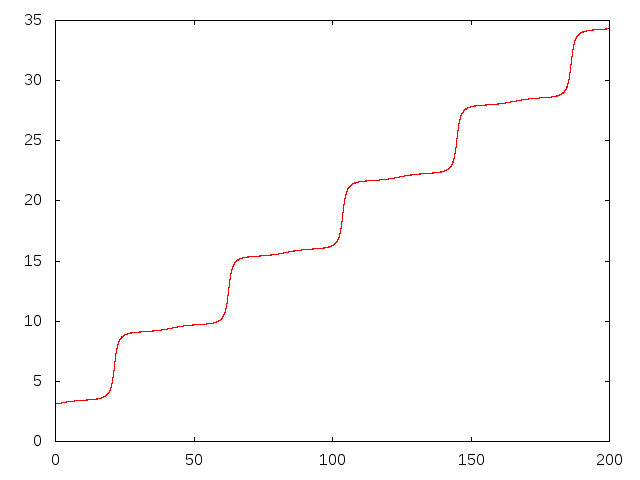

PHYS2200Pendulum
================

In this question, we had to create a program to model the rotation of a pendulum. First, I decoupled the given differential equation, to get the following two equation system:

dL/dt = -[1 - x*w*sin(t*w)]*sin(p)
dp/dt = L

The value of "w" decided the stability of the system. We had to plot the position of the pendulum vs. time for a stable and unstable system.

Here is a plot of the system when it's stable, with Omega equal to 150:

Here's a plot of the system when it's unstable, with Omega equal to 110:

The following is the point at which the system seems to go from unstable to stable, at 144.5:

